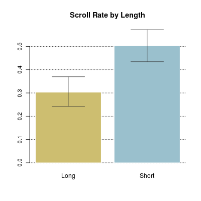
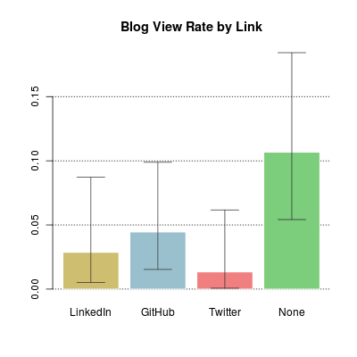
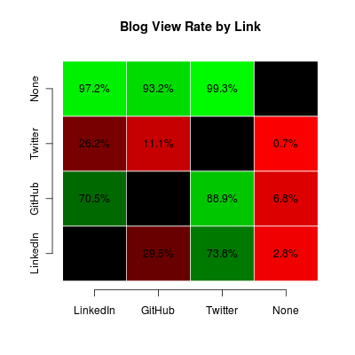
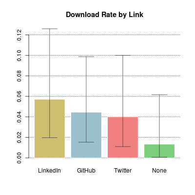
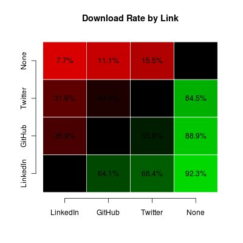
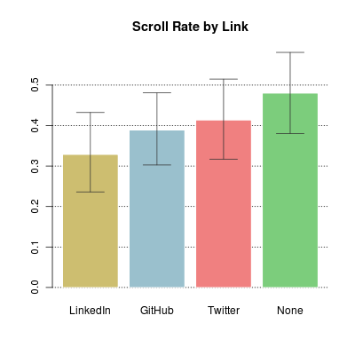

<h3>Objective</h3>

I’ll admit it: my résumé doesn’t stand out. I’ve had some great internships, but also a tendency to work for companies that aren’t (yet!) household names. And though I’m doing fine academically, it’s not well enough to stand  out on my marks alone.

On the other hand, my blog lets me stand out. I’ve had a few opportunities to meet and interview with some great people and companies because they read my blog. Naturally, then, the primary goal of my résumé is to get people to visit my blog. Since I don’t <em>quite</em> have the audacity to make my résumé a note telling people to visit my blog, I’m faced with the problem of how to optimize my résumé to ensure people see my blog. That’s where this experiment comes in.

<h3>Methodology</h3>

I started thinking about variables in my résumé that could affect the rate at which people viewed my blog. I narrowed it down to three that I could easily test.

The first is the <strong>length</strong> of the résumé. My friends <a href="http://www.meetrajesh.com">Rajesh</a> and <a href="http://www.eng.uwaterloo.ca/~smsshafi/index.php?newsfile=080921">Shams</a> are adamant about keeping their résumés down to a single page. Their arguments are sound, but I wanted to see if the data would back up their beliefs. I created a “short” version of my résumé which I squeezed into one page by omitting the <em>Awards</em> section and removing some skills.

Second, I wanted to know how my <strong>grades</strong> affected the résumé. Obviously I couldn’t start making things up, but since my major average differs from my overall average by a good margin, I had two numbers that I could use truthfully with a subtle change in wording.

Finally, I wanted to test whether it pays to include <strong>social media links</strong> on the résumé. I chose <a href="http://github.com/paulgb">GitHub</a>, <a href="http://www.linkedin.com/in/paulgb">LinkedIn</a>, and <a href="http://twitter.com/paulgb">twitter</a> as the links to test. GitHub was an obvious choice because it emphasizes my free-time projects. LinkedIn seemed like a good one to test, given that it is for professional networking. I chose twitter as another variation because I was curious to see what the reaction to a more personal social networking site would be. All résumés linked back to my blog as well. Finally, I had another resume which linked <strong>only</strong> to my blog, as a control group.

In all, these three variations resulted in 16 unique résumés. Fortunately I didn’t have to create them all by hand. I was already using LaTeX for my résumé, using one of the elegantly typeset templates from <a href="http://www.cv-templates.info/">The CV Inn</a> as a base. I simply threw my latest résumé into a <a href="http://www.makotemplates.org/">Mako Template</a> and wrote some python code to spit out the 16 possible variations of the LaTeX code. Then I used <em>pdflatex</em> to create pdf files. Since I was putting the résumés online, I made a landing page. To keep things simple, the landing page was just an image version of the résumé with a link to download the pdf, and just enough CSS to look presentable.

I wanted to track three things: how many people <strong>downloaded</strong> the résumé, how many people <strong>scrolled to the bottom</strong> of the landing page, and how many people <strong>visited my blog</strong>. The first I accomplished by logging downloads. The second I accomplished with <a href="http://jquery.com/">jQuery</a> and an Ajax callback. The third I accomplished with a tracking image, just like hit counters in the 90s. I used IP address and cookies to match up actions with the associated résumé.

The only remaining problem was how to get hundreds of people to see my résumé in a short period of time. Fortunately Google offered me $110 in AdWords credits as a Google Analytics user, so I took advantage of that and ran ads on Google searches. Here is one of the half-dozen variations I ran:

<h3>Results</h3>

After less than a week, I managed to exhaust my AdWords budget and gather a fair bit of data. I wrote a few hadoop jobs with my <a href="http://github.com/paulgb/haskell_hadoop">new toy</a> and then brought the data into R for analysis and visualization.

<h4>Length</h4>

As you might expect, the people who encountered the short resume were much more likely to scroll to the bottom. Just over half did, versus just under a third of those presented with the long resume. This makes sense because there is less to scroll through, but it was nice to have the data confirm my suspicions. Note that in the following graph, and all others in this post, the grey lines indicate the 90% confidence interval.

The short résumé also resulted in more downloads and blog views, but not enough to be statistically significant with the amount of data I collected.

<h4>Grades</h4>

The grades shown on the résumé didn’t affect any of the metrics I was measuring in a statistically significant way.

<h4>Links</h4>

I was surprised to find that the non-blog link shown on my résumé affected the frequency of click-throughs to my blog. Even adding a link to my GitHub profile more than halved the frequency of a clickthrough to my blog. LinkedIn and twitter were even worse.

I created a heatmap-like visualization from the relative significances of each link to each other. For example, the upper leftmost cell means that it is 97.2% likely that if a sufficiently large group of people were exposed to each of the LinkedIn and blog-link-only versions of my résumé, the group that saw the blog-link-only version would visit my blog more. <a href="http://20bits.com/">Jesse E. Farmer</a> has written more about the details of <a href="http://20bits.com/articles/statistical-analysis-and-ab-testing/">how this is calculated</a>.

Oddly, the effect was reversed when you consider downloads rather than blog views. The résumés without any social media links were far less likely to be downloaded than those with. Even a résumé with a twitter profile did better than one without, though not by enough to be statistically significant.

The additional links also reduced the frequency of readers scrolling to the bottom of the page.

<h3>Conclusion</h3>

There are two main things I learned from this experiment. First, I’m going to keep social network links off of my résumé. Although they increased the download rate, they decreased visits to my blog. Since the latter is my priority, I’m not going to start adding social networks to my résumé.

Second, the short résumé did better in every way. However, the improvement in blog views was not statistically significant. For now, I’m keeping my online résumé at two pages, but I will use the one-page version in print.

There’s a number of disclaimers I should make here. For one, even if my findings are true of my résumé, they might not be true of other résumés. Maybe a change in layout would diminish the effect of linking to social media profiles, or make the longer résumé convert better. I should also point out that I have no way of knowing who my audience was. They probably weren’t all in a position to hire a programmer or data scientist, so the factors that make them visit my blog may or may not have the same effect on those who are.

And finally, a shameless plug. I’m looking for an interesting <strong>data science</strong> internship this fall (September to December 2010). If you’re doing cool things with data, I’d be glad to hear from you. My contact information is in the sidebar.

