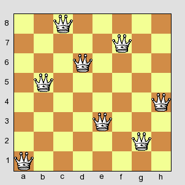

Most people who like puzzles or study computer science have probably encountered the famous <a href="http://en.wikipedia.org/wiki/Eight_queens_puzzle">N-Queens problem</a>. If you haven’t, before reading any further, try this <a href="http://www.hbmeyer.de/backtrack/achtdamen/eight.htm">online version</a> of the most popular form, the 8-Queens problem.

The 8-Queens problem is to find positions on a chess board for eight <a href="http://en.wikipedia.org/wiki/Queen_(chess)">queen</a> chess pieces so that none of them “threaten” the others. Since a queen in chess can move horizontally, vertically, and diagonally, this means placing each queen on her own horizontal, vertical, and diagonal lines.

The N-Queens problem is a generalization of the 8-Queens problem with (surprise) *N* queens instead of 8, on an *N × N* board instead of a standard *8 × 8* chess board.

In the spirit of <a href="http://en.wikipedia.org/wiki/Perl#Perl_golf">Perl Golf</a>, I wondered what the minimal amount of code would be to solve the N-Queens problem. As an arbitrary target, I picked 140 characters, also the limit on message length imposed by Twitter. I picked Haskell, knowing its list functions and generally terse syntax would come in handy. Naturally, I broke all the conventions that would cost extra characters, like using whitespace and explicit function signatures.

Since Haskell modules have a bit of overhead that would use up my valuable characters, I had to cheat a bit by leaving the module declaration out. The only way to run the program unmodified is to name it <code><a href="http://www.haskell.org/ghc/docs/latest/html/users_guide/ghci-dot-files.html">.ghci</a></code> to trick GHCi into using it as a start script.

The result follows. I used 140 characters exactly, including the newline character.

    import Data.List
    let nqueens n=[zipWith(\x y->x:show y)['a'..]x|x<-permutations[1..n],(length$nub$zipWith(+)(x++x)$[0,-1..1-n]++[n..])==n*2]

Pretty, eh? Fine, maybe not, but it works:

    > nqueens 4
    [["a2","b4","c1","d3"],["a3","b1","c4","d2"]]
    > nqueens 5
    [["a2","b4","c1","d3","e5"],["a3","b1","c4","d2","e5"],
    ["a3","b5","c2","d4","e1"],["a4","b2","c5","d3","e1"],
    ["a2","b5","c3","d1","e4"],["a1","b3","c5","d2","e4"],
    ["a4","b1","c3","d5","e2"],["a5","b3","c1","d4","e2"],
    ["a1","b4","c2","d5","e3"],["a5","b2","c4","d1","e3"]]

The result is a list of queen positions given as <a href="http://en.wikipedia.org/wiki/Algebraic_chess_notation#Naming_squares_on_the_board">coordinates on a chess board</a> (generalizing them in the obvious way).

As an example, the result <code>["a1","b5","c8","d6","e3","f7","g2","h4"]</code> would look like this:

Before I explain how it works, I'll put the whitespace back in.

    import Data.List
    let nqueens n = [zipWith (\x y -> x : show y) ['a'..] x | x <- permutations [1..n], (length $ nub $ zipWith (+) (x ++ x) $ [0,-1..1-n] ++ [n..]) == n*2]

Ignore diagonal movements for now — we could call it the N-<a href="http://en.wikipedia.org/wiki/Rook_(chess)">Rooks</a> problem. If we want to place *N* rooks on a chess board so none of them are threatened, each needs to be in its own column and row. If you number the rows *1, 2, ..., N*, each solution corresponds to a permutation of these numbers. The board above, for example, would be <code>[1, 5, 8, 6, 3, 7, 2, 4]</code>. So to solve the N-Rooks problem in Haskell, all we need is <code>permutations [1..n]</code>.

That's a good start, but we have to consider the diagonal lines as well. The simplest way to do this is to assign the columns numbers from *1* to *N*. Then add those to the number of the row the queen in that column is in (remember, since we are using permutations, there is exactly one queen in each column).

For example, if we add <code>[1, 5, 8, 6, 3, 7, 2, 4]</code> and <code>[1, 2, 3, 4, 5, 6, 7, 8]</code>, we get <code>[2, 7, 11, 10, 8, 13, 9, 12]</code>. The resulting numbers are all different, so the queens are all on different diagonal lines — at least for downward diagonals. For upward diagonals, we could do the same thing but use <code>[N..1]</code> instead of <code>[1..N]</code>.

Since every character counts here, it's better if we can do both diagonal directions at once. This complicates things a bit because without caution, the numbers for upward diagonal lines will overlap with those for downward diagonal lines. Fortunately, we can just add a constant factor of at least *2N* to either set of lines. This is essentially what the code above does, although the arithmetic is a bit more cryptic to keep the character count down.

The resulting list will have *2N* elements — *N* for the upward diagonal lines and *N* more for the downward ones. Now we can use <code>nub</code> to rid the list of duplicates. If the list had no duplicates — that is, each queen is on her own diagonal lines — the length of that list will still equal *2N* after duplicates are removed. That makes it a valid solution, so it is included in the result.

I should note that this algorithm isn't (nearly) as efficient as a standard backtracking approach as described on Wikipedia's <a href="http://en.wikipedia.org/wiki/Eight_queens_puzzle_solutions">eight queens puzzle solutions article</a>. But good luck getting one of those solutions into a tweet.

