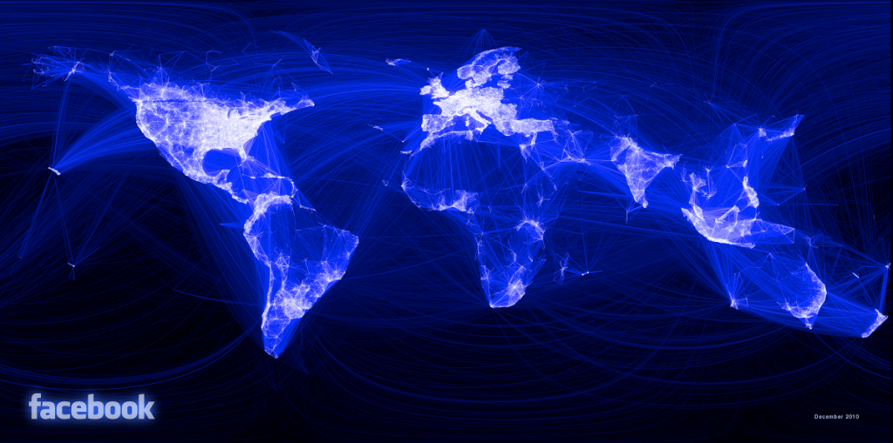

Earlier this week I [published a data visualization on the Facebook Engineering blog](http://www.facebook.com/notes/facebook-engineering/visualizing-friendships/469716398919) which, to my surprise, has [received](http://www.economist.com/blogs/dailychart/2010/12/data_visualisation_1) [a lot of](http://blogs.forbes.com/mikeisaac/2010/12/13/what-10-million-facebook-friendships-looks-like-a-data-visualization/?boxes=Homepagechannels) [media](http://www.nbcbayarea.com/news/tech/Facebook-Map-Reveals-Web-of-Connections-111883594.html) [coverage](http://newsfeed.time.com/2010/12/14/tracking-facebook-friendships-creates-a-stunning-global-map/)

I’ve received a lot comments about the image, many [asking for more details on how I created it](http://www.quora.com/What-data-visualization-software-did-Paul-Butler-use-to-create-the-Facebook-friend-visualization-map-published-on-12-14-10). When I tell people I used [R](http://www.r-project.org/), the reaction I get is roughly what I would expect if I told them I made it with [Microsoft Paint](http://en.wikipedia.org/wiki/Paint_%28software%29) and a bottle of [Jägermeister](http://en.wikipedia.org/wiki/J%C3%A4germeister). Some people even [questioned whether it was actually done in R](http://news.ycombinator.com/item?id=2002859). The truth is, aside from the addition of the logo and date text, the image was produced entirely with about 150 lines of R code with no external dependencies. In the process I learned a few things about creating nice-looking graphs in R.

### Transparency and Faking It

My first attempt at plotting the data involved plotting very transparent lines. Unfortunately there was just too much data to get a meaningful plot — even at very low opacity, there were enough lines to make the entire image just a bright blob. When I increased the transparency more, the opacity was rounded down to zero by my graphics device and the result was that nothing was drawn.

The solution was to manipulate the drawing order of the lines. I used a simple loop over my data to draw the lines, so it was easy to control which lines are drawn first using `order()`. I created an ordering based on the length of the lines, so that longer lines were drawn “behind” the shorter, more local lines. Then I used `colorRampPalette()` to generate a color palette from black to blue to white, and colored the lines according to order they were drawn.

### Great Circles

I wrote my own code to draw the [great circle](http://en.wikipedia.org/wiki/Great_circle) arcs, although I later found a [CRAN](http://cran.r-project.org/) package called [geosphere](http://cran.r-project.org/web/packages/geosphere/index.html) that would have done it for me (albeit with rougher lines near the poles). I drew the great circle arcs in a way that was easy to derive but slow to compute. I bisected the lines recursively, finding their great circle midpoint, until they were short enough to resemble an arc. To find the great circle midpoint, I converted from [spherical coordinate](http://en.wikipedia.org/wiki/Spherical_coordinate_system) to [Cartesian](http://en.wikipedia.org/wiki/Cartesian_coordinate_system), found the midpoint, then converted back to spherical coordinates and extended the radius.

### Euclidean Distance

Several observent commenters called me out on using [Euclidean distance](http://en.wikipedia.org/wiki/Euclidean_distance) on the projection for the ordering function. Having the ordering function depend on the distance on the projection seems counterintuitive, as Eucliden distance is wildly distorted near the poles. I accepted this drawback because the exact drawing order wasn’t important, as long as very long lines were drawn below very short ones.
