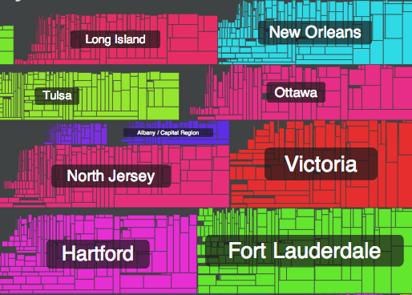

On Saturday, the Wall St. Journal [posted details of an internal Groupon memo](http:/online.wsj.com/article/SB10001424052748703408604576164641411042376.html) that reported $760 million in revenue last year.

The WSJ article came just as I was finishing up a visualization of some data I had collected on Groupon deals, which gives perspective on that massive number in terms of the individual deals.

Each box is a deal. I used height to represent number sold, and width to represent the price. Area is therefore gross revenue, and colour is city for the top 20 cities.

[Here is the full, interactive version.](http://gpvis.bitaesthetics.com) It only works in browsers which support SVG.

The 2D-bin-packing was implemented in R and C++, based on code by [mackstann](https://github.com/mackstann/binpack). Thanks to my friends [Eric](http://www.getinpulse.com/) and [Lisa](http://www.lisazhang.ca/) for feedback on a draft of the visualization.

